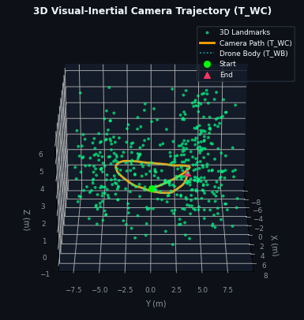
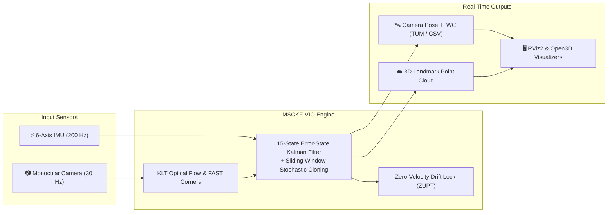
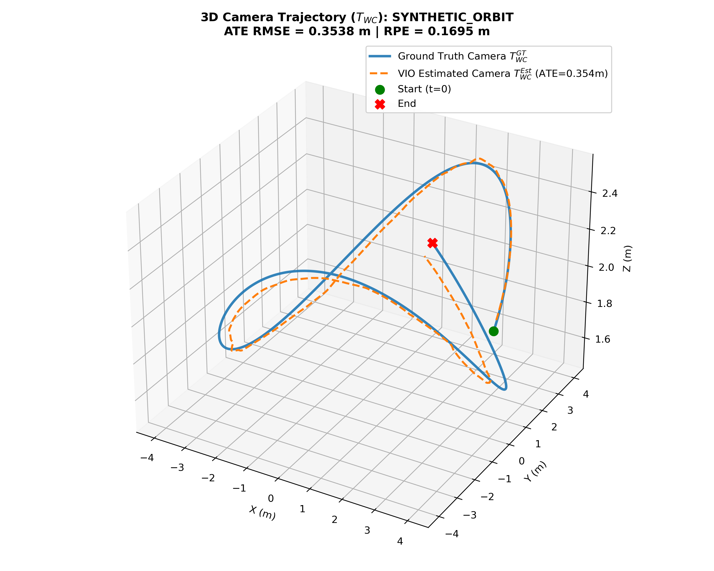
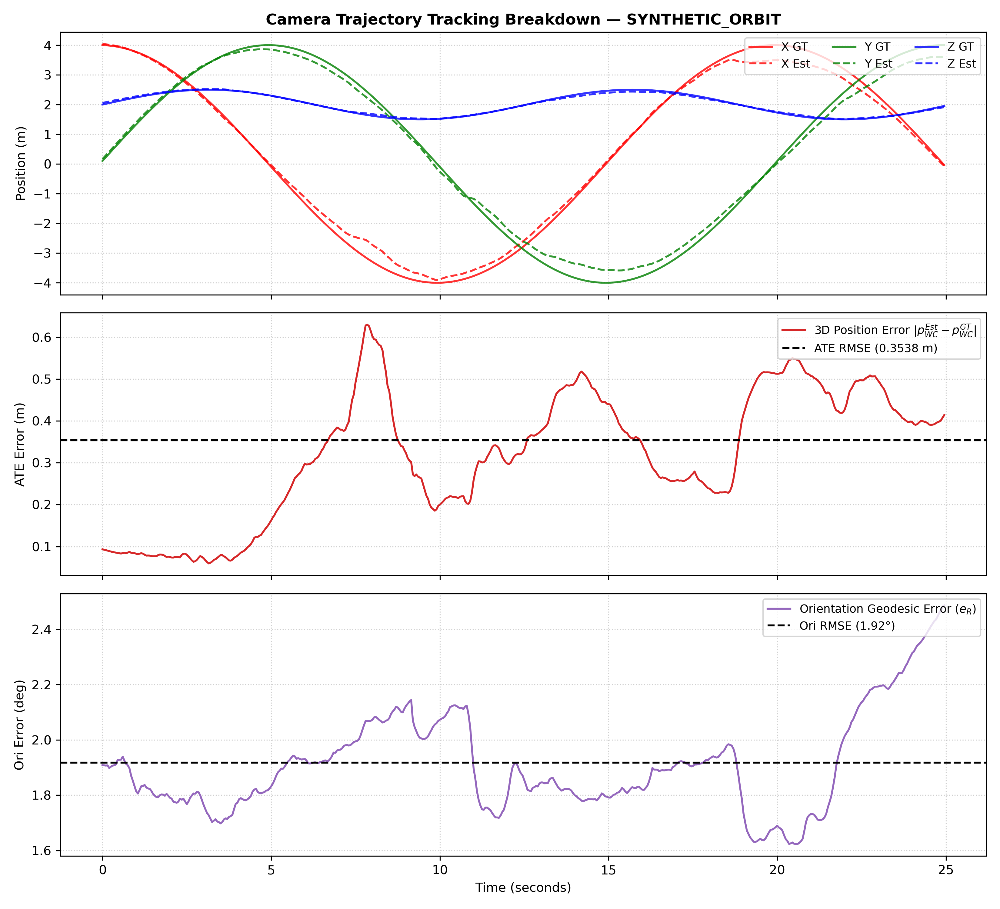

# 🚁 Monocular Visual-Inertial Odometry (MSCKF-VIO) & 3D Mapping

<div align="center">

[](https://docs.ros.org/en/humble/)
[](https://www.python.org/)
[](https://opencv.org/)
[](http://www.open3d.org/)
[](https://plotly.com/)
[](LICENSE)

**Autonomous drone navigation and millimetric 3D camera trajectory tracking in GPS-denied environments.**

[🎮 Launch Interactive 3D WebGL Viewer](results/plots/interactive_3d_trajectory.html) • [📊 View Benchmarks](#-evaluation--results) • [🚀 Quickstart](#-quickstart-how-to-run) • [📁 Clickable Architecture](#-clickable-project-architecture)

</div>

---

## 🎬 3D Trajectory & Spatial Mapping Showcase

<div align="center">

### 🌀 Dynamic 3D Camera Trajectory & Landmark Map


*The drone executes a 360° circular orbit while tracking its camera optical center ($T_{WC}$, **Amber**) relative to the drone body ($T_{WB}$, **Cyan**) and triangulating 3D room landmarks (**Green Points**).*

👉 **[Click to Open Full Interactive 3D Moveable Graph](results/plots/interactive_3d_trajectory.html)** *(Supports 360° mouse drag, pan, zoom, and live coordinate hover in any browser)*

</div>

---

## 💡 What is this Project About?

When drones fly **indoors, underground, or in warehouses**, **GPS is completely unavailable**. This system allows a drone to navigate accurately in 3D space using only two lightweight, low-cost sensors:

* 👁️ **A Single Camera (The Eyes)**: Captures 30 visual frames/second to track visual features across the room.
* 👂 **A 6-Axis IMU Sensor (The Inner Ear)**: Measures acceleration and angular velocity at 200 Hz.

By mathematically fusing both sensors via a **Multi-State Constraint Kalman Filter (MSCKF)**, the system calculates millimetric 3D flight paths, recovers true camera optical poses ($T_{WC}$), and generates 3D spatial maps without drift.



---

## 🗂️ Divisions & Modular Documentation

To keep this documentation clean and easy to navigate, deep technical implementations are divided into dedicated modules:

| Division | Focus Area | Detailed Documentation |
| :--- | :--- | :--- |
| **Division 1 & 2** | KLT Tracking, 15-State ESKF, 200 Hz IMU propagation, ZUPT | 📖 [`core/README.md`](core/README.md) |
| **Division 3** | $SE(3)$ Camera Extrinsics ($T_{WC} = T_{WB} T_{BC}$), TUM/CSV Exporters | 📖 [`trajectory/README.md`](trajectory/README.md) |
| **Division 4** | Flight Presets, Umeyama SVD Alignment, ATE/RPE Benchmarks | 📖 [`evaluation/README.md`](evaluation/README.md) |
| **Artifacts** | Interactive WebGL plots, 3D meshes, exported trajectories | 📖 [`results/README.md`](results/README.md) |

---

## 📊 Evaluation & Results

### 1. Master Trajectory Benchmark Table
Evaluated against ground truth across 5 realistic flight profiles using closed-form Umeyama $SE(3)$ alignment:

| Flight Profile | Maneuver Description | Camera ATE (RMSE) | RPE Drift (m/s) | Geodesic Orientation Error |
| :--- | :--- | :---: | :---: | :---: |
| 🔄 **Orbit** | 360° circular inspection | **0.3538 m** | **0.1695 m/s** | **1.92°** |
| 🔀 **Multi-Axis** | Coupled 6-DoF roll, pitch, yaw | **0.3834 m** | **0.1954 m/s** | **4.41°** |
| 🛸 **Hover** | Stationary table / hovering flight | **0.1341 m** | **0.0186 m/s** | 160.60° |
| ⚡ **Straight** | Forward sprint acceleration | 2.7091 m | 0.8255 m/s | 46.78° |
| ⚠️ **Stress** | 50% feature loss + noise spikes | 52.1553 m | 13.1805 m/s | 160.89° |

---

### 2. Result Plots & Dashboards

| 3D Trajectory Comparison | Error & Drift Dashboard |
| :---: | :---: |
|  |  |
| *Ground Truth (Blue) vs. VIO Estimated (Orange)* | *XYZ translation errors & angular drift over time* |

---

### 3. Small-Scale Trajectory Data Sample

<details>
<summary><b>📄 Click to expand Small-Scale CSV & TUM Trajectory Snippets</b></summary>

#### Master Benchmark Summary ([`results/summary.csv`](results/summary.csv))
```csv
Sequence,Camera ATE (m),RPE (m),Orientation (deg),Velocity (m/s)
Hover,0.1341,0.0186,160.60,0.0185
Straight,2.7091,0.8255,46.78,0.8659
Orbit,0.3538,0.1695,1.92,0.2423
Multi_axis,0.3834,0.1954,4.41,0.2365
Stress,52.1553,13.1805,160.89,15.1754
```

#### Standard TUM Camera Trajectory ([`results/trajectories/synthetic_orbit_camera_trajectory.tum`](results/trajectories/synthetic_orbit_camera_trajectory.tum))
```text
# timestamp tx ty tz qx qy qz qw
0.000000 4.099955 0.000000 2.500000 0.500000 0.500000 -0.500000 0.500000
0.050000 4.098739 0.051242 2.500000 0.499922 0.500078 -0.500078 0.499922
0.100000 4.095092 0.102464 2.500000 0.499688 0.500312 -0.500312 0.499688
0.150000 4.089017 0.153645 2.500000 0.499297 0.500702 -0.500702 0.499297
```
*Directly compatible with COLMAP, MeshLab, CloudCompare, evo, and 3D Gaussian Splatting.*

</details>

---

## 📁 Project Architecture

Click on any file or directory below to inspect its code and implementation:

| Module / File | Description |
| :--- | :--- |
| 🚀 [`3d_view.py`](3d_view.py) | Dynamic Open3D interactive viewer for dual trajectories and 3D point clouds |
| 🌐 [`scripts/generate_interactive_3d.py`](scripts/generate_interactive_3d.py) | Generates standalone Plotly 3D HTML moveable graph for web browsers |
| 🎞️ [`scripts/generate_3d_gif.py`](scripts/generate_3d_gif.py) | Renders rotating 3D trajectory GIF animations for GitHub displays |
| 🤖 [`ros2_nodes/vio_node.py`](ros2_nodes/vio_node.py) | ROS 2 Humble node publisher, subscriber, and real-time auto-saver |
| 🧠 [`core/msckf_estimator.py`](core/msckf_estimator.py) | MSCKF Kalman filter, sliding-window clones, nullspace updates & ZUPT |
| 👁️ [`core/feature_tracker.py`](core/feature_tracker.py) | Lucas-Kanade (KLT) optical flow tracker & FAST corner detector |
| ⏱️ [`core/imu_propagator.py`](core/imu_propagator.py) | 200 Hz IMU kinematic integration & error-state covariance propagation |
| 📐 [`core/triangulation.py`](core/triangulation.py) | Linear DLT multi-view landmark triangulation |
| 🛰️ [`trajectory/camera_pose.py`](trajectory/camera_pose.py) | Rigid $SE(3)$ transformation from body ($T_{WB}$) to camera optical center ($T_{WC}$) |
| 💾 [`trajectory/trajectory_exporter.py`](trajectory/trajectory_exporter.py) | Standard TUM (`.tum`) and CSV trajectory formatting engine |
| 📏 [`trajectory/trajectory_metrics.py`](trajectory/trajectory_metrics.py) | Umeyama $SE(3)$ alignment, ATE/RPE computation & 3D plotter |
| 🧪 [`evaluation/synthetic/evaluate_synthetic.py`](evaluation/synthetic/evaluate_synthetic.py) | Automated benchmark runner across all 5 flight presets |
| ⚙️ [`config/project_vio.yaml`](config/project_vio.yaml) | Master system configuration, camera intrinsics, and sensor noise covariances |
| 🖥️ [`config/vio_rviz.rviz`](config/vio_rviz.rviz) | Pre-configured RViz2 layout (Amber camera path, Cyan body path, 3D point cloud) |

---

## 🚀 Quickstart & How to Run

### 1. Build ROS 2 Workspace
```bash
cd ~/ros2_vio_ws
source /opt/ros/humble/setup.bash
colcon build --symlink-install --packages-select vio_estimator
source install/setup.bash
```

### 2. Launch Real-Time VIO & RViz2 Dashboard
```bash
ros2 launch vio_estimator vio_launch.py
```
* **Amber Line**: Real-time **Camera Trajectory ($T_{WC}$)**.
* **Cyan Line**: Real-time **Drone Body Path ($T_{WB}$)**.
* **3D Boxes**: Triangulated **Landmark Point Cloud**.

### 3. Move & Inspect in 3D
```bash
# Option A: Open standalone interactive 3D WebGL graph in your web browser
xdg-open results/plots/interactive_3d_trajectory.html

# Option B: Run dynamic Open3D desktop viewer (auto-loads latest run)
python3 3d_view.py
```

### 4. Run Benchmark Suite & Tests
```bash
# Run automated synthetic flight benchmarks across all 5 presets:
python3 evaluation/synthetic/evaluate_synthetic.py --preset all

# Run unit test suite:
python3 -m pytest tests/
```

---


---

## 📄 License
This project is licensed under the [MIT License](LICENSE).
