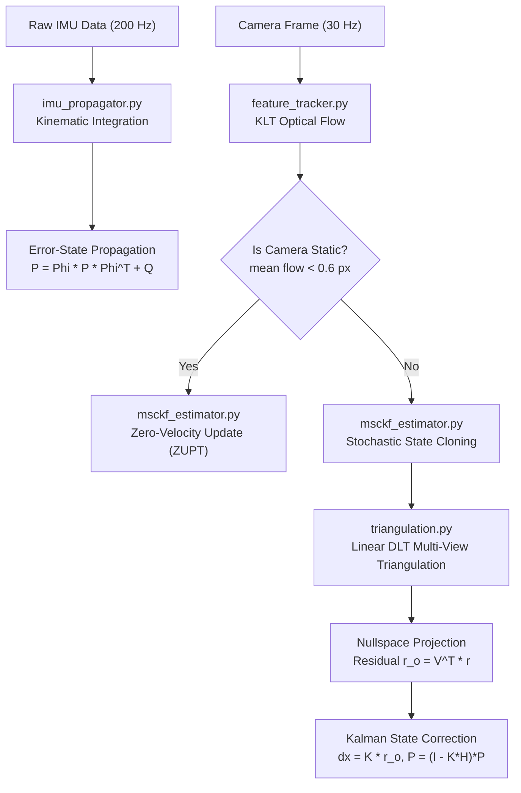

# ⚙️ Core Module — Mathematical MSCKF VIO Engine

The `core/` directory contains the foundational mathematics, state estimation filters, and visual tracking pipelines implementing the **Multi-State Constraint Kalman Filter (MSCKF)** for monocular visual-inertial odometry.

---

## 🏛️ Architecture & Component Mapping

| File | Primary Responsibility | Key Equations / Algorithms |
| :--- | :--- | :--- |
| [`msckf_estimator.py`](msckf_estimator.py) | Master MSCKF filter & state manager | Sliding window cloning, Nullspace projection ($V^T H_f = 0$), ZUPT |
| [`feature_tracker.py`](feature_tracker.py) | Lucas-Kanade (KLT) optical flow tracking | Pyramidal optical flow, bidirectional error ($<0.5\text{px}$), grid bucketing |
| [`imu_propagator.py`](imu_propagator.py) | 200 Hz IMU kinematic state propagation | Continuous-time state transition $\Phi(t_k + \Delta t, t_k)$, $SO(3)$ matrix exponential |
| [`triangulation.py`](triangulation.py) | 3D feature position estimation | Multi-view Linear Direct Linear Transform (DLT) via SVD |
| [`math_utils.py`](math_utils.py) | Lie algebra & rotation conversions | Rodrigues exponential $\exp(\lfloor \theta \times \rfloor)$, unit quaternions |
| [`frames.py`](frames.py) | Spatial frame definitions | Coordinate transforms between World ($W$), Body ($B$), and Camera ($C$) |
| [`state.py`](state.py) | Data contracts & types | `VIOState` structure, covariance slicing |

---

## 📐 Mathematical Pipeline

---

## 🔬 Core Innovations

### 1. Sliding Window Stochastic Cloning
Instead of inserting 3D landmark points permanently into the state vector (which causes $O(N^3)$ computational scaling like traditional EKF-SLAM), MSCKF clones historical camera poses at past image capture times:
$$\mathbf{X} = \begin{bmatrix} \mathbf{x}_B^T & \mathbf{x}_{C_1}^T & \dots & \mathbf{x}_{C_N}^T \end{bmatrix}^T$$

### 2. Nullspace Residual Projection
When a tracked feature drops out, its multi-view residual is linearized:
$$r_j = H_{x,j} \tilde{\mathbf{X}} + H_{f,j} \tilde{\mathbf{p}}_f + n_j$$
By projecting onto the left nullspace of landmark Jacobian $H_f$ ($V^T H_f = 0$):
$$r_{o,j} = V^T r_j = V^T H_{x,j} \tilde{\mathbf{X}} + V^T n_j$$
The 3D point $\tilde{\mathbf{p}}_f$ cancels out completely, allowing state updates without expanding the covariance matrix.

### 3. Zero-Velocity Update (ZUPT)
When the drone rests stationary on a desk:
* Zero optical parallax prevents feature triangulation.
* Unconstrained double-integration of IMU accelerometer bias causes quadratic position drift.
* `msckf_estimator.py` detects stationary states (`mean_optical_flow < 0.6 px`) and injects a pseudo-measurement $v_{WB} = \mathbf{0}$, locking dead-reckoning drift and calibrating accelerometer bias in real time.
