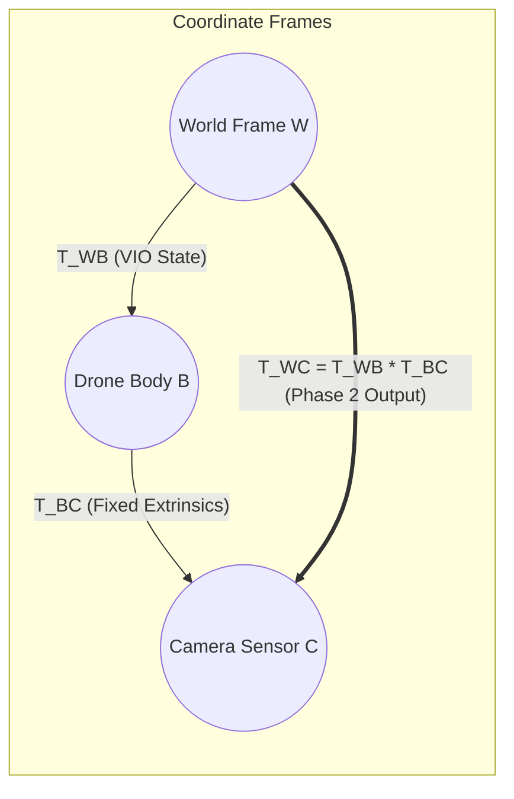

# 🛰️ Trajectory Module — Camera Optical Trajectory & Transformation Engine

[]()
[]()

The `trajectory/` package implements the geometric bridge between the drone body center ($T_{WB}$) and the true camera optical sensor ($T_{WC}$), standardized robotics trajectory exporters, and closed-form trajectory evaluation metrics.

---

## 🏛️ Components

| File | Primary Responsibility | Output Format / Algorithms |
| :--- | :--- | :--- |
| [`camera_pose.py`](camera_pose.py) | Rigid $SE(3)$ Body-to-Camera transformation | $T_{WC} = T_{WB} T_{BC}$, unit quaternion normalization |
| [`trajectory_exporter.py`](trajectory_exporter.py) | Universal trajectory formatting | Standard TUM (`.tum`) & CSV (`.csv`) exporters |
| [`trajectory_metrics.py`](trajectory_metrics.py) | SLAM evaluation & benchmarking | Umeyama SVD $SE(3)$ alignment, ATE (RMSE), RPE, Geodesic $\theta_{err}$ |

---

## 📐 Geometric Formulation



### The $SE(3)$ Extrinsic Transformation:
$$T_{WC} = T_{WB} T_{BC} = \begin{bmatrix} R_{WB} & p_{WB} \\ 0 & 1 \end{bmatrix} \begin{bmatrix} R_{BC} & p_{BC} \\ 0 & 1 \end{bmatrix}$$
$$p_{WC} = p_{WB} + R_{WB} p_{BC}, \quad R_{WC} = R_{WB} R_{BC}$$

---

## 💾 Export Formats

### 1. Standard TUM Format (`.tum`)
Universally compatible with SLAM tools (`evo`), COLMAP, CloudCompare, and 3D Gaussian Splatting:
```text
# timestamp tx ty tz qx qy qz qw
0.000000 4.099955 0.000000 2.500000 0.500000 0.500000 -0.500000 0.500000
0.050000 4.098739 0.051242 2.500000 0.499922 0.500078 -0.500078 0.499922
```

### 2. Comprehensive CSV Format (`.csv`)
Includes full linear velocity vectors for dynamic drone controller feedback:
```csv
timestamp,tx,ty,tz,qx,qy,qz,qw,vx,vy,vz
0.000,4.0999,0.0000,2.5000,0.5000,0.5000,-0.5000,0.5000,0.000,1.025,0.000
```
