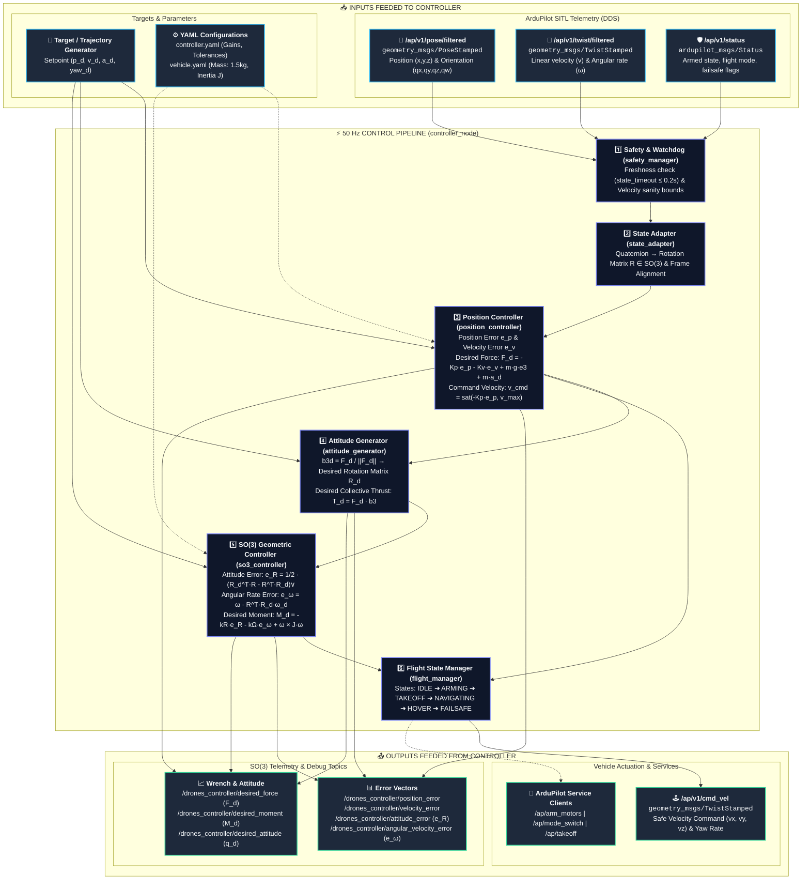

# 🛸 Drones Controller (SO(3) Geometric & Closed-Loop Autonomous Flight)

ROS 2 package providing high-precision **closed-loop 3D trajectory tracking** and **geometric $SO(3)$ attitude control** for autonomous multicopters interfaced with **ArduPilot SITL** and **Gazebo** over ROS 2 / micro-ROS (DDS).

---

## 🔄 Controller Workflow & Architecture

The controller operates as a dual-loop cascaded system at **50 Hz**: an outer-loop **Position Controller** generating desired forces and velocity commands, paired with an inner-loop **Geometric $SO(3)$ Controller** for full non-linear attitude tracking and telemetry.



---

## 📊 Inputs & Outputs Specification

### 📥 Inputs Feeded to Controller

| Source / Topic | Message Type | Rate | Description / Use Case |
| :--- | :--- | :--- | :--- |
| `/ap/v1/pose/filtered` | `geometry_msgs/msg/PoseStamped` | 50 Hz | Current estimated position $(x, y, z)$ and orientation quaternion $(q_x, q_y, q_z, q_w)$. |
| `/ap/v1/twist/filtered` | `geometry_msgs/msg/TwistStamped` | 50 Hz | Vehicle linear velocities $(v_x, v_y, v_z)$ and body angular rates $(\omega_x, \omega_y, \omega_z)$. |
| `/ap/v1/status` | `ardupilot_msgs/msg/Status` | 10 Hz | ArduPilot armed state, flight mode (GUIDED), and failsafe flags. |
| `target.*` / Waypoints | ROS Parameters / Target Manager | Event | Desired target setpoint $(x_d, y_d, z_d, \psi_d)$. |
| `config/controller.yaml` | YAML Parameters | Static | $K_p$, $K_v$, $k_R$, $k_\Omega$ gains, velocity limit ($0.5\text{ m/s}$), tolerances ($0.10\text{ m}$). |
| `config/vehicle.yaml` | YAML Parameters | Static | Vehicle physical properties: Mass ($1.5\text{ kg}$), Inertia matrix $J = \text{diag}(0.02, 0.02, 0.04)$. |

### 📤 Outputs Feeded from Controller

| Destination / Topic | Message Type | Rate | Description / Action |
| :--- | :--- | :--- | :--- |
| `/ap/v1/cmd_vel` | `geometry_msgs/msg/TwistStamped` | 50 Hz | Autonomous velocity setpoint vector $(v_x, v_y, v_z)$ and yaw rate $\dot{\psi}$ sent to ArduPilot. |
| `/ap/arm_motors` | `ardupilot_msgs/srv/ArmMotors` | Event | Service client to arm quadrotor motors. |
| `/ap/mode_switch` | `ardupilot_msgs/srv/ModeSwitch` | Event | Service client to switch vehicle mode to `GUIDED`. |
| `/ap/takeoff` | `ardupilot_msgs/srv/Takeoff` | Event | Service client initiating autonomous vertical takeoff. |
| `/drones_controller/position_error` | `geometry_msgs/msg/Vector3Stamped` | 50 Hz | Tracking error vector $e_p = p - p_d$ in meters. |
| `/drones_controller/velocity_error` | `geometry_msgs/msg/Vector3Stamped` | 50 Hz | Velocity tracking error $e_v = v - v_d$ in m/s. |
| `/drones_controller/desired_force` | `geometry_msgs/msg/Vector3Stamped` | 50 Hz | Computed 3D total thrust force vector $F_d$ in Newtons. |
| `/drones_controller/desired_moment` | `geometry_msgs/msg/Vector3Stamped` | 50 Hz | Computed 3-axis SO(3) control moment $M_d$ in N·m. |
| `/drones_controller/attitude_error` | `geometry_msgs/msg/Vector3Stamped` | 50 Hz | Non-linear rotation error $e_R = \frac{1}{2}(R_d^T R - R^T R_d)^\vee$. |
| `/drones_controller/angular_velocity_error` | `geometry_msgs/msg/Vector3Stamped` | 50 Hz | Angular rate error vector $e_\Omega = \omega - R^T R_d \omega_d$. |
| `/drones_controller/desired_attitude` | `geometry_msgs/msg/PoseStamped` | 50 Hz | Desired target orientation quaternion $q_d$. |

---

## 🗂️ Folder Structure

```text
.
├── config/
│   ├── controller.yaml              # Controller gains, update rate, tolerances, safety limits
│   └── vehicle.yaml                 # Physical quadrotor parameters (mass, gravity, inertia)
├── drones_controller/               # Python core modules
│   ├── __init__.py
│   ├── controller_node.py           # Main ROS 2 50 Hz closed-loop control node
│   ├── ardupilot_interface.py       # DDS/ROS 2 interface for ArduPilot topics and services
│   ├── target_manager.py            # Target position & setpoint manager
│   ├── trajectory_generator.py      # Analytical waypoint & path generator
│   ├── position_controller.py       # Outer-loop PID/PD position & velocity controller
│   ├── attitude_generator.py        # Generates desired rotation matrix R_d & collective thrust
│   ├── so3_controller.py            # Lie-algebraic SO(3) geometric attitude controller
│   ├── flight_manager.py            # Flight state machine (IDLE, TAKEOFF, NAVIGATING, HOVER)
│   ├── safety_manager.py            # Watchdog, command saturation, and failsafe enforcement
│   ├── state_adapter.py             # Quaternion ↔ SO(3) rotation matrix conversion
│   ├── command_interface.py         # Formats and safely dispatches commands to ArduPilot
│   ├── telemetry_logger.py          # Real-time state, error, and wrench logging
│   ├── frame_converter.py           # ENU ↔ NED coordinate transformation utilities
│   └── teleop.py                    # Keyboard teleoperation utility node
├── launch/
│   ├── controller.launch.py         # Standard controller launch file with parameters
│   └── simulation_controller.launch.py # Full simulation launch file
├── resource/
│   └── drones_controller            # Ament index package marker
├── test/                            # Automated pytest unit test suite
│   ├── test_attitude_generator.py
│   ├── test_frame_converter.py
│   ├── test_position_controller.py
│   └── test_so3_controller.py
├── .gitignore                       # Clean ignore rules (excludes pycache, build, logs)
├── LICENSE                          # Project license
├── package.xml                      # ROS 2 package manifest and dependencies
├── setup.cfg                        # Executable script install directives
├── setup.py                         # ROS 2 Python package installer
└── README.md                        # Documentation and architecture workflow
```

---

## 🚀 Quickstart & Usage

### 1. Build Package
Clone or place inside your ROS 2 workspace `src/` folder:
```bash
cd ~/ardu_ws
colcon build --packages-select drones_controller
source install/setup.bash
```

### 2. Launch Controller Node
```bash
ros2 launch drones_controller controller.launch.py
```

### 3. Run Unit Tests
```bash
colcon test --packages-select drones_controller
colcon test-result --verbose
```
